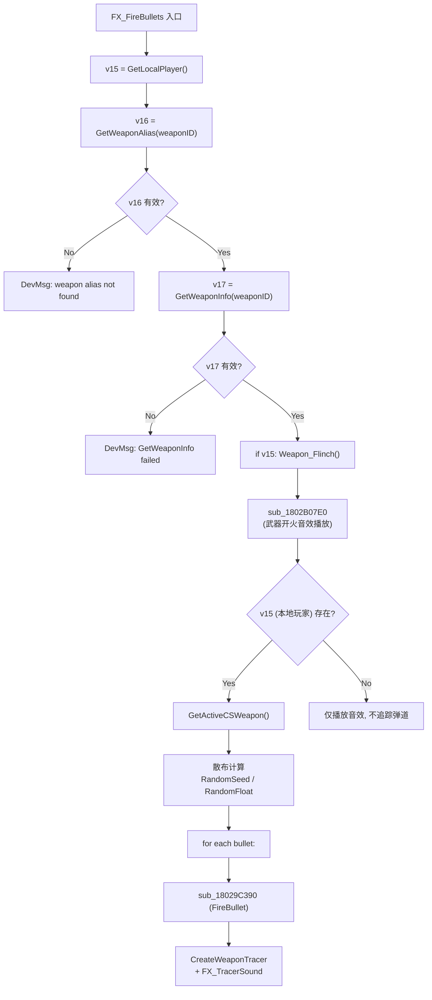

================================================================================
client.dll (64-bit) — TE_FireBullets 调用链 & 预测 Filter 分析
================================================================================

| 项目       | 说明                                                         |
|------------|--------------------------------------------------------------|
| 目标文件   | `client.dll`                                                 |
| ImageBase  | `0x180000000`                                                |
| 架构       | x86-64                                                       |
| 源参考     | `E:\CSSO-NOOFFICIAL-MP` (CS:S Offensive MP 源码)             |
| 辅助文件   | `server.dll` (session `f9950732`)                             |
| 工具       | `ida-pro-mcp` (idalib headless)                              |
| 日期       | 2026-07-18                                                   |
| 背景       | 客户端预测导致 ViewModel 弹道不准确，commit `b8afa769b112b6664ea761fa053d45548630626c` 修复了弹道但音效异常 |


## 1 — `TE_FireBullets` 客户端数据表

客户端注册了 `DT_TEFireBullets` 数据表（`sub_1800281E0` @ `0x1800281E0`）：

| 偏移 | 名称              | 类型   | 大小 |
|------|-------------------|--------|------|
| +32  | `m_iPlayer`       | int    | 4    |
| +36  | `m_vecOrigin`     | Vector | 12   |
| +48  | `m_vecAngles[0]`  | float  | 4    |
| +52  | `m_vecAngles[1]`  | float  | 4    |
| +60  | `m_iWeaponID`     | int    | 4    |
| +64  | `m_iMode`         | int    | 4    |
| +68  | `m_iSeed`         | int    | 4    |
| +72  | `m_fInaccuracy`   | float  | 4    |
| +76  | `m_fSpread`       | float  | 4    |
| +80  | `m_iSoundType`    | int    | 4    |
| +84  | `m_flRecoilIndex` | float  | 4    |


## 2 — `CTEFireBullets` 客户端 Handler (vtable)

`CTEFireBullets` 类在客户端通过 vtable 注册，类名 `"CTEFireBullets"` @ `0x1806A2168`：

| 偏移         | 函数                                       | 说明                        |
|--------------|--------------------------------------------|-----------------------------|
| `vtable[0]`  | `sub_180048FE0`                            | base (constructor?)         |
| **`vtable[1]`** | **`sub_18027E4C0`**                    | **消息处理回调 (PostDataUpdate)** |
| `vtable[2]`  | `sub_1800B44F0`                            |                             |
| `vtable[3]`  | `sub_1800B8D40`                            |                             |
| `vtable[4]`  | `sub_180048FE0`                            |                             |
| `vtable[5]`  | `sub_1800D9420` (return `a1-8`)            | GetDataDescMap?             |
| `vtable[6]`  | `sub_180048FE0`                            |                             |
| `vtable[7]`  | `sub_180048FE0`                            |                             |

vtable 数据位于 `0x1806A2128`，通过 `0x18082CBE8` 处的 TE 类描述符链表按名称查找。


## 3 — 🔴 核心发现：三条 `FX_FireBullets` 调用路径

客户端 `FX_FireBullets` (`sub_1802B0190` @ `0x1802B0190`) 有三个调用者，**服务端 TE 路径没有本地玩家过滤**：

### 3.1 Path A — 服务端 TE 消息路径 (无过滤!)

```
客户端接收 CTEFireBullets TEMessage
  → TE系统按名称查找 → vtable[1] 回调
    → sub_18027E4C0 (CTEFireBullets handler @ 0x18027E4C0)
      │ a10 = 0  ← 固定传 0!
      ↓
    → sub_1802B0190 (FX_FireBullets)
```

`sub_18027E4C0` 反编译：

```cpp
void __fastcall sub_18027E4C0(__int64 a1)  // a1 = TE struct
{
    *(_DWORD *)(a1 + 48) = 0;   // 清零某个字段
    sub_1802B0190(
        *(_DWORD *)(a1 + 24) + 1,   // player index + 1
        (__int64 *)(a1 + 28),       // m_vecOrigin
        a1 + 40,                    // m_vecAngles
        *(_DWORD *)(a1 + 52),       // m_iWeaponID
        *(_DWORD *)(a1 + 56),       // m_iMode
        *(_DWORD *)(a1 + 60),       // m_iSeed
        *(float *)(a1 + 64),        // m_fInaccuracy
        *(float *)(a1 + 68),        // m_fSpread
        *(_DWORD *)(a1 + 72),       // m_iSoundType
        0,                          // ← a10 = 0
        *(float *)(a1 + 76));       // m_flRecoilIndex
}
```

**🔴 `sub_18027E4C0` 没有任何本地玩家过滤逻辑！** 它不检查 `m_iPlayer` 是否是本地玩家，直接无条件调用 `FX_FireBullets`。

### 3.2 Path B — 客户端预测路径

```
sub_18030B3C0 (C_BasePlayer/Weapon Think @ 0x18030B3C0)
  │ 条件: weaponData[+3173] && ammo>0 && nextFireTime<=curTime
  ↓
sub_180307660 (客户端预测开火 @ 0x180307660)
  │ 计算: vecSrc = EyePosition() + muzzleOffset
  │ v32 = 1 或 11 (取决于武器状态)
  ↓
sub_1802B0190 (FX_FireBullets) ← a10 = 1 或 11
```

`a10` 赋值条件：
```cpp
if ( *(_DWORD *)(v4 + 1952) != 1 || (v5 = *(_BYTE *)(a1 + 3628) == 0, v32 = 11, v5) )
    v32 = 1;
// v4[1952] == 1 且 a1[3628] != 0 → v32 = 11
// 否则 → v32 = 1
```

### 3.3 Path C — 武器模式切换路径

```
sub_18030E600 (武器模式更新 @ 0x18030E600)
  │ a1[886] = a1[423] & 1  (设置 m_weaponMode)
  ↓
sub_18030C7B0 (副武器/模式开火 @ 0x18030C7B0)
  │ 类似 Path B，但用于 SecondaryAttack
  ↓
sub_1802B0190 (FX_FireBullets)
```


## 4 — `FX_FireBullets` 内部逻辑 (`sub_1802B0190`)



**关键**: `FX_FireBullets` 内部用 `sub_18022DC90()` 获取**本地玩家**（不是用 `a1` 参数中的 `m_iPlayer`）。只要本地玩家存在，即使 TE 消息是关于其他玩家的，弹道也会以本地玩家身份执行 `FireBullet`。


## 5 — 🔴 双重处理问题

当**本地玩家**开火时：

```
时间线:
  1. 客户端预测 → Path B → FX_FireBullets(a10=1/11)
     ├─ 武器音效 (本地)
     ├─ FireBullet (本地弹道)
     └─ CreateWeaponTracer → FX_TracerSound (本地音效)

  2. 服务端处理 → 发送 CTEFireBullets TE 消息

  3. 客户端接收 TE → Path A → FX_FireBullets(a10=0)
     ├─ 武器音效 (服务端音效类型)
     ├─ FireBullet (服务端弹道)  ← 覆盖!
     └─ CreateWeaponTracer → FX_TracerSound (服务端音效)
```


## 6 — `a10` 参数对比

| 来源            | `a10` 值   | 含义推测                          |
|-----------------|------------|-----------------------------------|
| TE handler (Path A) | **0**  | 不启用附加效果 / 使用服务端音效    |
| 预测路径 (Path B)   | **1**  | 标准客户端效果                     |
| 预测路径 (Path B)   | **11** | 特殊武器模式（如 AUG/SG556 开镜）  |

`a10` 在 `sub_1802B07E0`（音效分发器）中被写入声效结构体的偏移 `+0x50` 处，影响音效播放行为。


## 7 — `TracerSound` 注册链

```
sub_180016F90 (TracerSound 注册)
  └─ 注册 "TracerSound" → handler = sub_18019F130
       └─ sub_18019EC30(v2, a1)  ← 提取 vecStart/vecEnd
           │  还会尝试从 ViewModel attachment 获取起点!
           └─ sub_1801809B0(v2, a1, *(_DWORD *)(a1 + 48))  ← FX_TracerSound
                └─ 根据 m_iSoundType 播放近战音效
                   (Bullets.DefaultNearmiss / Bullets.GunshipNearmiss 等)
```

⚠️ `sub_18019EC30` 内部会尝试通过 ViewModel 的 attachment 来修正起点——这可能是 **ViewModel 坐标不准确**的另一个来源。


## 8 — 修复方向分析

### 8.1 问题根因

TE_FireBullets handler (`sub_18027E4C0`) **没有本地玩家过滤**，导致：
1. **弹道双重处理**：预测弹道 + 服务端弹道都被执行
2. **音效来源不一致**：TE 路径的 `a10=0` 和预测路径的 `a10=1/11` 可能导致不同的音效行为
3. **ViewModel 坐标污染**：`sub_18019EC30` 从 ViewModel attachment 读起点可能读到错误坐标

### 8.2 commit `b8afa769` 推测修复

大概率在 TE handler 或其上游增加了本地玩家过滤：
```cpp
// 推测的修复逻辑
if (m_iPlayer == GetLocalPlayerIndex())
    return;  // 本地玩家已有预测处理，跳过 TE
```

这样做：
- ✅ 弹道只用预测路径（正确）
- ❌ 但如果某些音效**只在** TE 路径中播放（`a10=0` 触发的特定逻辑），就会被跳过
- ❌ 如果跳过的是整个 `FX_FireBullets`，连 `sub_1802B07E0` 的音效也丢了

### 8.3 建议检查方向

1. **对比 `sub_1802B07E0` 中 `a5`(=`a10`) 的不同值行为**
   - `a10=0` vs `a10=1` vs `a10=11` 在音效结构体 offset `+0x50` 处的差异
2. **检查 `sub_18019EC30` 的 ViewModel attachment 逻辑**
   - TracerSound 获取起点时可能从 ViewModel 错误地读取坐标
3. **服务端 `m_iSoundType` 的赋值**
   - 确认服务端 `FX_FireBullets` 中 `m_iSoundType` 的取值是否与客户端预测一致
4. **不要完全跳过 TE handler**
   - 如果加本地玩家过滤，应**只跳过 `FireBullet` 弹道部分**，保留 `sub_1802B07E0` 的音效分发


## 9 — 完整函数映射表

| 客户端函数        | 地址          | 说明                                      |
|-------------------|---------------|-------------------------------------------|
| `sub_1800281E0`   | `0x1800281E0` | DT_TEFireBullets 数据表注册                |
| `sub_18027E4C0`   | `0x18027E4C0` | **CTEFireBullets handler** (vtable[1])     |
| `sub_1802B0190`   | `0x1802B0190` | **FX_FireBullets** (客户端)                |
| `sub_1802B07E0`   | `0x1802B07E0` | 武器音效分发器 (按 m_iSoundType 查表)      |
| `sub_1802B0980`   | `0x1802B0980` | C_FireSmoke (枪口烟雾)                     |
| `sub_180307660`   | `0x180307660` | 客户端预测开火 (Path B)                    |
| `sub_18030B3C0`   | `0x18030B3C0` | 武器 Think / 状态更新                      |
| `sub_18030C7B0`   | `0x18030C7B0` | 副武器/模式开火 (Path C)                   |
| `sub_18030E600`   | `0x18030E600` | 武器模式切换 → Path C                      |
| `sub_180016F90`   | `0x180016F90` | "TracerSound" handler 注册                 |
| `sub_18019F130`   | `0x18019F130` | TracerSound handler                        |
| `sub_18019EC30`   | `0x18019EC30` | GetTracerOrigin (含 ViewModel attachment)  |
| `sub_1801809B0`   | `0x1801809B0` | FX_TracerSound (子弹呼啸音效)              |

| 服务端函数        | 地址          | 说明                                      |
|-------------------|---------------|-------------------------------------------|
| `sub_180375140`   | `0x180375140` | **FX_FireBullets** (服务端)                |
| `sub_18037A900`   | `0x18037A900` | TE_FireBullets 发送                        |


## 附录：工具排坑

| 问题   | `decompile` 等工具返回 `"disabled by user"` |
|--------|---------------------------------------------|
| **根因** | `ida-pro-mcp` 从 IDA netnode 读取 `enabled_tools` 配置并持久化在 `.i64` 文件中 |
| **修复** | 删除 `.i64` → 重新 `idb_open` → 工具恢复默认(全启用) |

================================================================================
EOF
